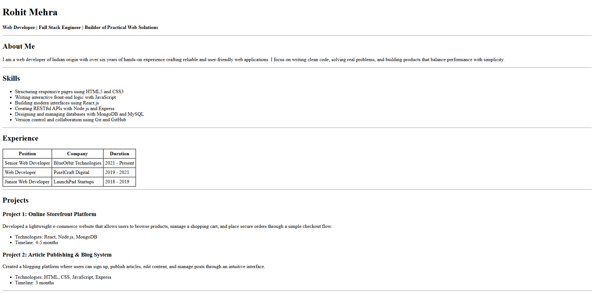
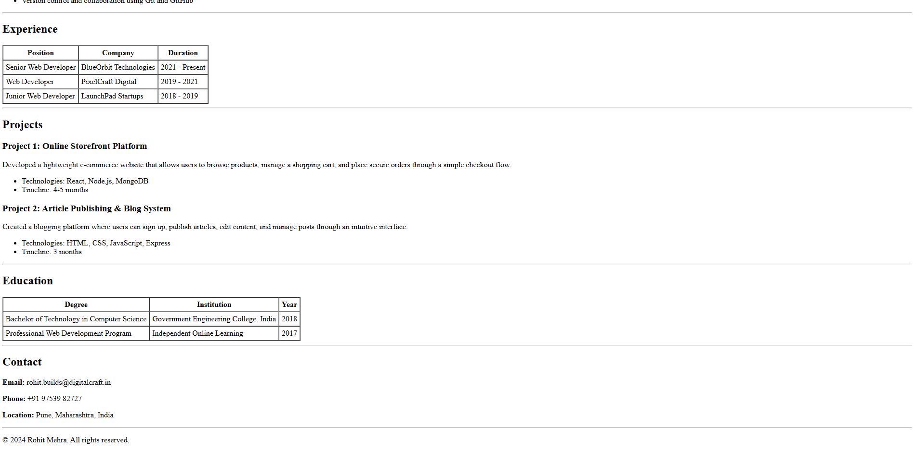

# Html-Resume-Website
A simple resume website, using only html
## Getting Started
Follow these steps to run the project locally.

1. Clone the repository:
   ```bash
   git clone 
   ```
2. Navigate to the project directory:
   ```bash
   cd Html-Resume-Website
   ```
3. Open the `index.html` file in your web browser to view the resume template.
## Screenshots


